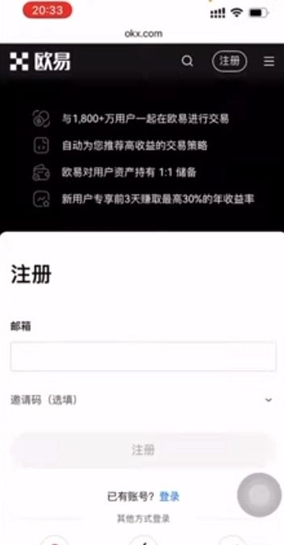
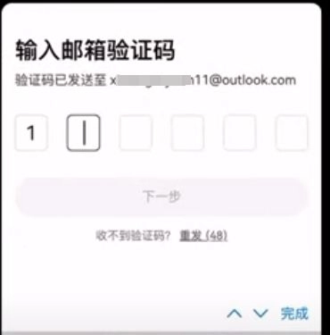
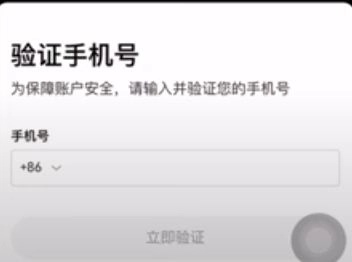
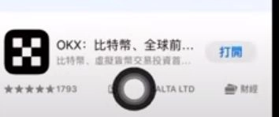
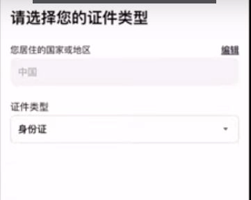
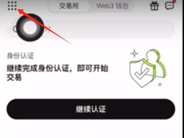

# OKX Exchange Registration Guide | How to Save 20% on Trading Fees

Looking to start trading crypto but worried about sky-high fees eating into your profits? Here's the thing—most people don't realize they're leaving money on the table by skipping invitation codes during registration. With OKX's invitation code system, you can unlock 20% fee rebates and mystery box rewards worth up to $60,000 in BTC, ETH, and other tokens. This guide walks you through the entire process, from registration to your first trade, in plain language that actually makes sense.

---

## Why Bother with an OKX Invitation Code?

OKX is one of those exchanges that actually rewards you for joining through an invitation. It's not just marketing fluff—you get real benefits:

- **20% cashback on trading fees**. If you're planning to trade regularly, this adds up fast.
- **Mystery box rewards** that can contain anything from a few dollars to $60,000 worth of crypto.

Think of it like this: You're going to register anyway. Might as well grab the bonuses while you're at it.

## What You'll Need Before Starting

Just the basics:
- A working email address
- Your phone number
- An ID (passport or national ID card works)
- About 10 minutes of your time

That's it. No complicated paperwork, no endless forms.

## Step-by-Step: Creating Your OKX Account

### Step 1: Hit the Registration Page

👉 [Start your OKX registration here and claim your welcome bonuses](https://www.okx.com/join/47044926)

The page loads, you see the sign-up form. Nothing fancy, just straightforward.

### Step 2: Verify Your Email and Phone

First, they'll ask for your email. Type it in, grab the verification code from your inbox, paste it back. Done.

Then comes your phone number. Select your country code (+86 if you're in China), enter the number, get another code via SMS, verify that too.

### Step 3: Create a Password and Download the App

Pick a strong password. You know the drill—mix of letters, numbers, maybe throw in a symbol or two.

Then download the OKX app. They'll prompt you right there on the page. It's available for both iOS and Android.

### Step 4: Complete Identity Verification

Open the app, log in with your new credentials. Now comes the KYC part—Know Your Customer, basically proving you're a real person.

Select your country of residence (China by default if that's where you are). Upload photos of your ID—front and back if it's a national ID, or your passport photo page.

Then they'll ask you to do a quick face scan. Just follow the on-screen instructions. Hold your phone at eye level, make sure there's decent lighting, and let the camera do its thing.

Verification usually takes a few minutes. Sometimes it's instant, sometimes you wait a bit. Grab a coffee if you need to.

## Getting Money Into Your Account

### Step 5: Set Up Your Payment Methods

Before you can buy crypto, you need to tell OKX where to send your money when you sell, and where you'll pay from when you buy.

Tap the menu in the upper left, find "C2C Trading," then go to "Payment Method Management."

You can add:
- **Bank card**: Enter your card number and bank name
- **Alipay**: Type in your Alipay account and upload a screenshot of your payment QR code
- **WeChat Pay**: Same deal—account info and QR code

### Step 6: Buy Your First USDT

USDT is basically crypto's version of the dollar. Stable, predictable, and what you'll use to trade for other coins.

From the home screen, tap "Buy Crypto" → "C2C Trading."

Make sure "Buy" is selected at the top, choose USDT as your coin. Enter how much you want to buy—let's say ¥200 for example.

The system shows you a list of merchants. Look for ones with high transaction counts and good ratings. That's your best bet for a smooth transaction.

Tap "Buy Now" on your chosen merchant. They'll show you their payment details—might be Alipay, bank transfer, or WeChat.

Send the money using whatever method they specified. Once you've paid, hit "I have paid" in the app.

Now you wait. The merchant checks their account, sees your payment, and releases the USDT to you. Usually takes anywhere from a few minutes to half an hour.

## Making Your First Trade

### Step 7: Move Funds to Your Trading Account

Your USDT landed in your "Funding Account." But to actually trade, you need it in your "Trading Account."

Go to Assets, find USDT, tap "Transfer." Select "From Funding Account to Trading Account," enter the amount, confirm.

### Step 8: Buy Bitcoin (or Whatever You Want)

Head to the trading section. Search for BTC/USDT if you want Bitcoin, or any other trading pair.

You'll see two main options:
- **Market order**: Buy right now at current price
- **Limit order**: Set your own price and wait for the market to hit it

For your first time, market order is simpler. Just enter how much USDT you want to spend, hit buy, and you're done.

The app executes the trade immediately, and boom—you now own crypto.

## Cashing Out When You're Ready

### Step 9: Selling Your Crypto for Cash

Let's say you made some profit (nice!) and want to cash out.

First, transfer your USDT back from Trading Account to Funding Account. Same process as before, just reversed.

Go back to "Buy Crypto" → "C2C Trading," but this time select "Sell" at the top.

Choose USDT, enter how much you want to sell, pick your payment method (this is where those payment details you set up earlier come in handy).

The system matches you with a buyer. They send you the cash to your bank/Alipay/WeChat, you confirm receipt, then release the USDT to them.

👉 [Ready to start? Register with code 47044926 and unlock your 20% fee discount](https://www.okx.com/join/47044926)

## Quick Things to Remember

**Verify everything before you send money.** Check the merchant's profile, read their ratings, make sure you're sending to the right account. One wrong digit and your money goes to someone else's pocket.

**OKX support is there if you need it.** Something goes wrong? Don't panic. Contact their customer service. They're pretty responsive.

**Crypto prices bounce around.** A lot. Sometimes wildly. Don't put in money you can't afford to lose. This isn't a savings account—it's more like... well, it's like trading. Sometimes you win, sometimes you don't.

Use invitation code **47044926** when you register to maximize your welcome bonuses and trading fee rebates.

---

## Wrapping This Up

Setting up an OKX account isn't rocket science. You fill out some forms, verify your identity, add some payment methods, and you're ready to trade. The whole process takes maybe 20 minutes if you've got your documents handy.

The key thing? Use that invitation code. That 20% fee rebate actually matters when you're trading regularly. And those mystery boxes? Sure, you might not hit the $60,000 jackpot, but free crypto is free crypto.

OKX works because it's straightforward—no weird hoops to jump through, reasonable verification requirements, and plenty of payment options for users in different regions. Whether you're just dipping your toes into crypto or you're ready to dive in, [registering through the invitation link](https://www.okx.com/join/47044926) gives you the best starting position.

Just remember: crypto moves fast, prices change, and what goes up can definitely come down. Trade smart, start small, and don't bet the farm on any single coin.

---

**Disclaimer: Cryptocurrency trading involves significant risk. This guide is for educational purposes only. Make your own investment decisions based on your personal financial situation and risk tolerance.**
